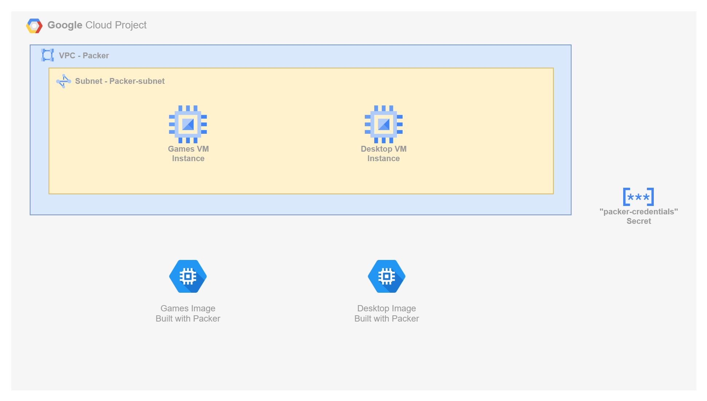

# Building VM Images with Packer in GCP

In the GCP solution, we use Packer to build and deploy custom **Linux** and **Windows** images to Compute Engine.

- For **Linux**, we create an Ubuntu-based image with Apache installed and deploy several retro-style HTML games.
- For **Windows**, we install Chrome and Firefox, apply the **latest Windows Updates**, and execute **Sysprep** using native PowerShell commands.
- GCP **automatically installs WinRM**, but additional setup is required — we use a **metadata startup script** to set the WinRM password and configure authentication.
- We define a **custom firewall rule** to allow WinRM traffic (TCP 5986) so that the Windows instance is accessible for remote management.
- Image builds run within a custom **VPC and subnet** that are pre-provisioned to support isolated, controlled access.
- The Windows image supports **RDP** access using a local `packer` account, and the Linux image is tested via **HTTP** on port 80.

